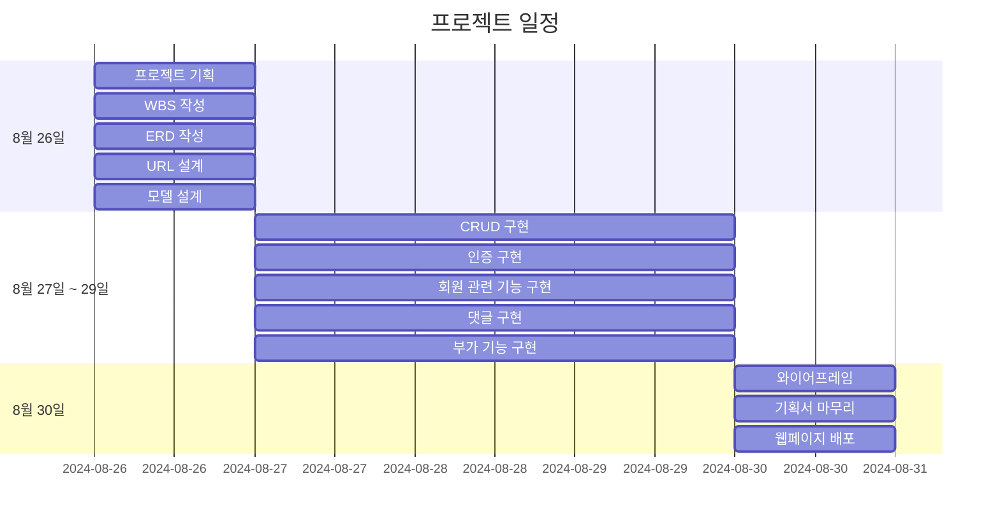

# Django를 활용한 블로그 프로젝트
## WBS

```mermaid
gantt
    title 프로젝트 일정
    dateFormat  YYYY-MM-DD
    section 8월 26일
    프로젝트 기획           :a1, 2024-08-26, 1d
    WBS 작성                :a2, 2024-08-26, 1d
    ERD 작성                :a3, 2024-08-26, 1d
    URL 설계                :a4, 2024-08-26, 1d
    모델 설계               :a5, 2024-08-26, 1d

    section 8월 27일 ~ 29일
    CRUD 구현               :b1, 2024-08-27, 3d
    인증 구현               :b2, 2024-08-27, 3d
    회원 관련 기능 구현     :b3, 2024-08-27, 3d
    댓글 구현               :b4, 2024-08-27, 3d
    부가 기능 구현          :b5, 2024-08-27, 3d

    section 8월 30일
    와이어프레임            :c1, 2024-08-30, 1d
    기획서 마무리          :c2, 2024-08-30, 1d
    웹페이지 배포          :c3, 2024-08-30, 1d
```

