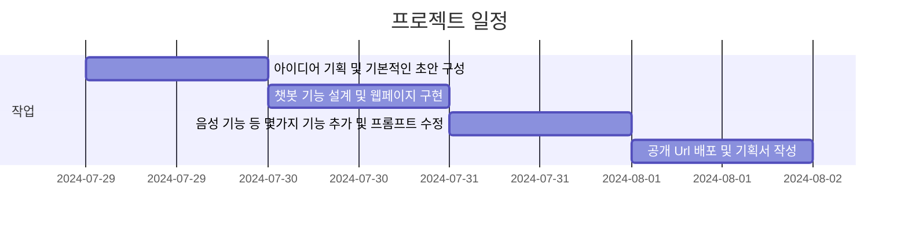
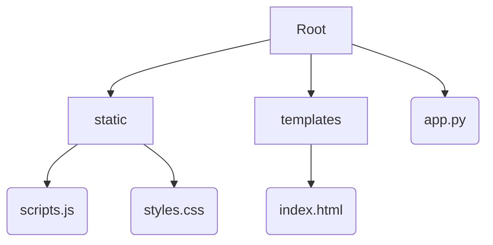

# **Hana** : GPT API를 활용한 일본어 회화 실습 프로젝트

## 1. 프로젝트 기획

### 기획 아이디어
  - GPT API로 구현한 챗봇을 활용 할 수 있는 방법 모색
  - 작성자 본인이 j-pop 노래 부르기 취미를 갖고 있지만, 일본어 회화 능력이 부족한 점을 고려
  - 작성자를 포함하여 일본 회화 실습 실력을 키우고 싶어하는 학습자들에게 수요가 있을 것이라 판단함

### 계획 설계 및 개발자 도구 선정
  - 프롬프트 관련 설정
    - 사용자가 진짜 일본어 회화 선생님처럼 느낄 수 있게 자유도를 높힐 것
    - 너무 복잡하고 어려운 말이 아닌, 일상 생활에서 간단하게 사용할 수 있는 단어와 문법을 사용자에게 명시
    - 사용자와의 대화를 이끌어 나가며, 사용자의 답변을 유도할 수 있는 여러 질문들을 던질 것
    - 사용자에게 선정적이거나 불쾌한 말투를 사용하지 말고, 존댓말을 쓸것

  - Web 관련 기능 설정
    - 우측 상단에 사용시 주의사항 버튼을 두어, 사용자가 클릭 시 관련 안내사항을 확인할 수 있을 것
    - Voice 버튼에 토글 기능을 넣어 음성 인식중임을 확인할 수 있게 만들 것
    - 채팅이 채팅 창을 넘어설 시 자동으로 스크롤을 아래로 내려서 사용자가 회화에만 집중 할 수 있게 만들 것
    - Enter 키로도 채팅의 기록을 서버로 전달 할 수 있도록 Event를 추가할 것
  - 음성 인식 및 발성 기능 설정
    - 사용자의 음성 인식 후 자동으로 대화 기록을 서버로 전달 할 수 있도록 지정 해 놓을 것
    - 한국어 및 일본어를 같이 발성 시 회화에 시간이 지체될 수 있으므로 일본어 발성 기능만 설정 해 놓을 것

  **<사용한 개발자 도구들 및 구현 기능 >**
  ```md
  Python(Flask) : GPT API 호출 및 회화 서비스용 프롬프트 설계
  Html : 기본적인 Web 구조 구현
  Css : Web의 간단한 디자인 구현
  JavaScript : 사용자와 API 간의 비동기 통신 구현, Web의 기본적인 기능 설계
  ```

## 2. 개발 일정



## 3. 구조 및 설계

### 디렉토리 구조

### 와이어 프레임


## 4. 시연 및 오류

[일반 채팅 및 음성 인식 채팅 테스트](https://yoo117.github.io/Private-Repository/)

### 발생 오류 및 시정

- 음성 발성을 인식하는 문제
  - 음성 인식 후 AI의 발성 답변을 다시 스스로 인식, 그에 따른 답변을 산출하는 문제 발생
  - 음성 인식 후 일정 시간동안 음성 인식을 끄는 기능 설계 -> 대화 로그의 무작위 특성 상 정확하게 시간 지정이 어려움 (채택 x)
  - AI가 음성을 발성하는동안 인식함수를 끄는 함수를 만듦 -> AI 자신의 음성은 인식할 수 없고 정확히 사용자의 음성만 인식하게 됨

- 음성 발성 언어 문제
  - 일본어 음성 발성을 하는 함수를 넣음 -> 한국어도 어색한 일본어로 발음하게 되는 문제 발생
  - 일본어, 한국어 음성을 동시에 발성 할 수 있는 기능을 넣음 -> 코드 상의 문제로 여전히 일본어로만 발성하는 문제 발생 (채택 x)
  - AI의 산출 대화 로그에서 일본어만 추리는 함수 기능을 넣음 -> 오직 일본어만 인식한 후 발성 (현재 상황)
  - AI 산출 대화문에서 특정 일본어 구문이 반복됨에도 불구하고 반복해서 읽게 되는 상황 발생 (이는 문장 반복 시 이를 또 추려내는 함수 기능 필요)

- voice 버튼 문제
  - 사용자가 음성 인식 버튼을 누른 후, 음성 인식이 진행되는지 헷갈리는 상황 발생
  - 음성 인식 버튼에 토글 기능을 넣음 ->  음성 인식이 진행되고 있다는 사실을 사용자에게 명시 가능

- 프롬프트 끼리 충돌
  - 한국어로 피드백을 설명 & 답변 채팅에 너무 많은 문장을 사용하지 말 것 프롬프트가 충돌 -> 피드백이 종종 생략되는 문제 발생
  - 규칙으로 둔 프롬프트를 10개로 제한 및 겹치는 부분 방지, 일본어 문법 피드백을 확실히 하라는 프롬프트를 추가. 


## 5. 배포 및 추가 기능

### 공개 URL
**Hana** :
(https://5247b9f7-a0ab-44f1-b793-06342caa1505-00-22n07igtg5n15.sisko.replit.dev/)

### 배포 서비스 고려

- github : html, css, js까진 연동이 되었지만 python 추가 파일이 연동이 안되는 문제 발생 -> flask같은 동적 프로그램은 정적 스타일의 github에서 배포하기 힘들다? 는 gpt의 의견

- pythonanywhere : 가이드라인을 따라 파일 업로드 및 web 구현을 마쳤지만, 알 수 없는 에러로 구현이 안되는 상태 발생

- replit : 무료 버전에선 프로젝트를 실행 시킨 상태에서만 web이 구현이 되는 문제가 있지만, 비교적 실행이 간단하고 인터페이스가 친숙함. (현재 여기서 공개 URL 배포중입니다.)

### 추가 기능 고려

- 대화 로그 기록 기능 : 사용자마다 예전에 실습했던 회화 기록을 사이트에 남기며 언제라도 예전에 학습했던 내용을 복습할 수 있게 함
- AI 음성 발성 반복 기능 : 사용자가 원하는 일본어 문장을 클릭 시 다시 그 부분만 발성하여 사용자의 학습에 도움이 되게 하기
- 사용자 피드백 활용 기능 : 사용자가 즉시 서버로 피드백을 보낼 수 있게 하여, 추가적인 오류를 개선할 수 있게 하기

## 6. 회고

지난 3일(4일) 동안 막히는 부분도 많고 탈도 많았지만, 제가 원하는 서비스를 한번 개발해보는 즐거운 과정이였기에 즐거운 마음으로 프로젝트를 진행 해 볼 수 있었습니다. <br>또한 실제로 어떻게 개발이 진행되는지 그 과정을 살짝 체험해 볼 수 있었기에 이 경험 또한 매우 귀중하다고 생각이 듭니다.<br>모두 지난 3일동안 수고 많으셨고, 한번에 여러 프로젝트, 혹은 연속해서 진행하시는 모든 개발자님들 정말 존경합니다...

## 7. 강사님의 피드백

- flask의 필요성 : 지금 구현한 기능들은 flask까지 활용할 필요 없이 JavaScript로도 충분히 구현이 가능하다고 하셨으며, 이는 리소스 소모도 늘어날 수 있기에 과하다고 하셨다. 안 그래도 flask를 썼기에 github에서 공개 URL 배포를 하지 못하는 문제가 있기에, 다음부터는 충분히 이 점을 염두에 두어야겠다.
- github commit의 문제 : 이전에 commit의 message가 '1'로 많이 기록되어 있는 걸 보시고 문제를 지적하셨다. 이는 협업 과정에서도 충분히 문제가 될 수 있는 소지이기에, commit의 구체적인 정보를 나타내기 위해서 메세지를 남기도록 하며, 또 깃모지를 사용하는 것도 충분히 도움이 될 것이라고 생각한다.
- HTML의 기록 문제(?) : 내부 코드 주석에서 HTML을 'Html'로 작성한 것에 대해 문제를 지적하셨다. 별 것 아닌 것처럼 보여도, 충분히 주의를 기울이며 표기법에도 신경을 써야 한다.
