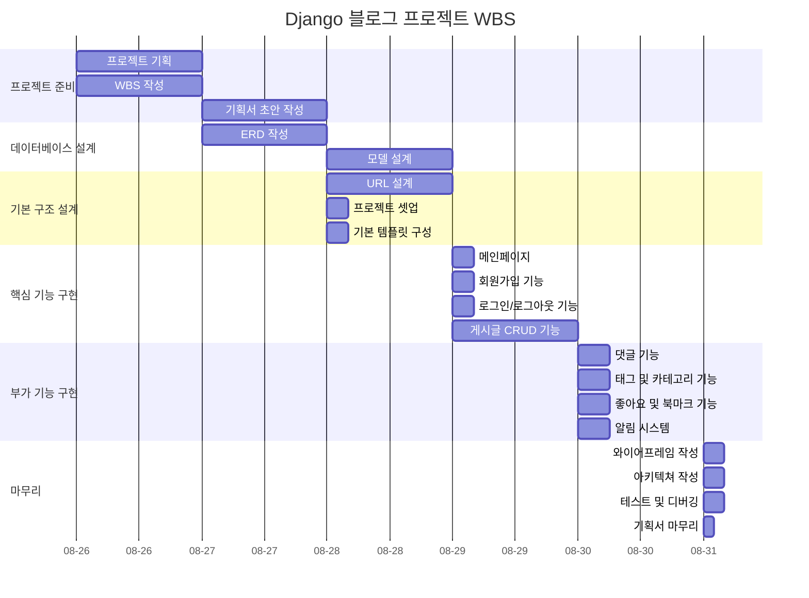
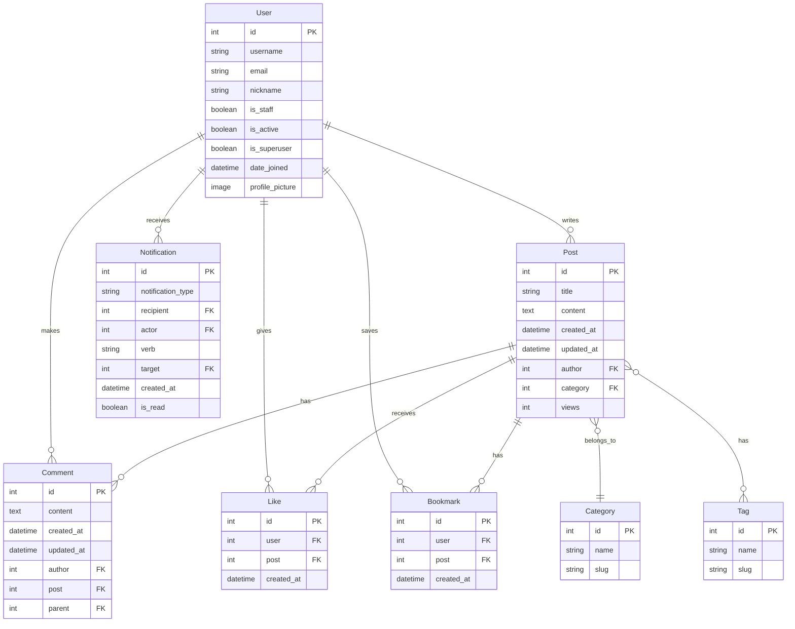

# 반려동물 커뮤니티 블로그
반려동물 이야기를 나누는 커뮤니티 블로그 프로젝트입니다.

## 1. 목표와 구현 기능
### 1.1 목표
### 1.2 기능

## 2. 개발 환경 및 배포 URL
### 2.1 개발 환경
### 2.2 URL 구조(모놀리식)
- Main App URLs

| URL Pattern | View Name | Description |
|-------------|-----------|-------------|
| `admin/` | admin.site.urls | 관리자 페이지 |
| `''` | include('posts.urls') | posts URL 포함 |
| `accounts/` | include('accounts.urls') | accounts URL 포함 |
| `interactions/` | include('interactions.urls') | interactions URL 포함 |

- Accounts App URLs

| URL Pattern | View Name | Description |
|-------------|-----------|-------------|
| `signup/` | SignupView | 유저 회원가입 |
| `login/` | LoginView | 유저 로그인 |
| `logout/` | LogoutView | 유저 로그아웃 |
| `profile/` | ProfileView | 유저 프로필 열람 |
| `profile/edit/` | EditProfileView | 유저 프로필 수정 |
| `password/change/` | ChangePasswordView| 유저 비밀번호 수정 |

- Posts App URLs

| URL Pattern | View Name | Description |
|-------------|-----------|-------------|
| `''` | home | Home page |
| `post/new/` | PostCreateView | 새 게시글 생성(로그인 필요) |
| `post/<int:pk>/` | PostDetailView | 특정 게시글 열람 |
| `post/<int:pk>/edit/` | PostUpdateView | 게시글 수정(로그인 필요, 본인 글만 가능) |
| `post/<int:pk>/delete/` | PostDeleteView | 게시글 삭제(로그인 필요, 본인 글만 가능) |
| `posts/` | PostListView | 모든 게시글의 리스트 |
| `category/<slug:category_slug>/` | CategoryPostsView | 카테고리별 게시글 리스트 |
| `tag/<slug:tag_slug>/` | TagPostsView | 태그별 게시글 리스트 |
| `search/` | SearchPostsView | 게시글 검색 |

- Interactions App URLs

| URL Pattern | View Name | Description |
|-------------|-----------|-------------|
| `post/<int:pk>/comment/` | AddCommentView | 게시글 댓글(로그인 필요) |
| `comment/<int:pk>/reply/` | AddReplyView | 게시글 댓글의 대댓글(로그인 필요) |
| `comment/<int:pk>/edit/` | EditCommentView | 댓글 수정(로그인 필요, 본인 글만 가능) |
| `comment/<int:pk>/delete/` | DeleteCommentView | 댓글 삭제(로그인 필요, 본인 글만 가능) |
| `post/<int:pk>/like/` | LikePostView | 게시글 좋아요 기능 |
| `post/<int:pk>/bookmark/` | BookmarkPostView | 북마크 기능(로그인 필요) |
| `notifications/` | NotificationsView | 유저 알림(로그인 필요) |

## 3. 프로젝트 구조와 개발 일정
### 3.1 프로젝트 구조
### 3.2 개발 일정(WBS)

## 4. 와이어프레임

## 5. 데이터베이스 모델링(ERD)

## 6. 메인 기능
## 7. 에러와 에러 해결
## 8. 회고
