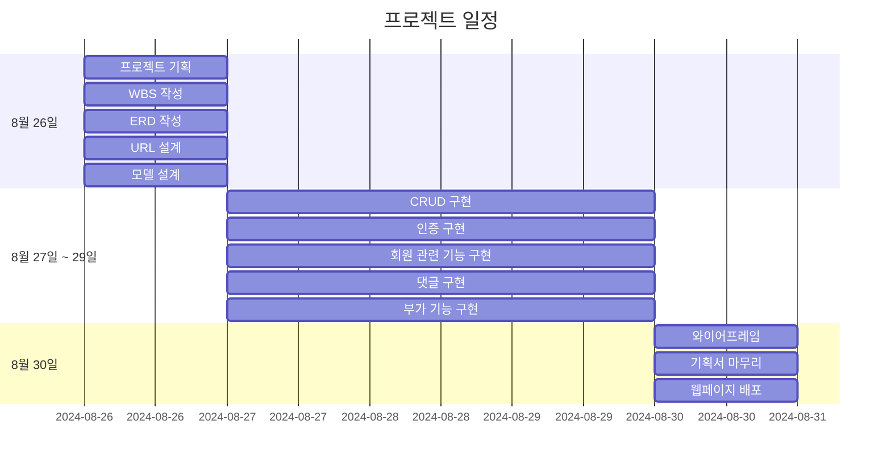
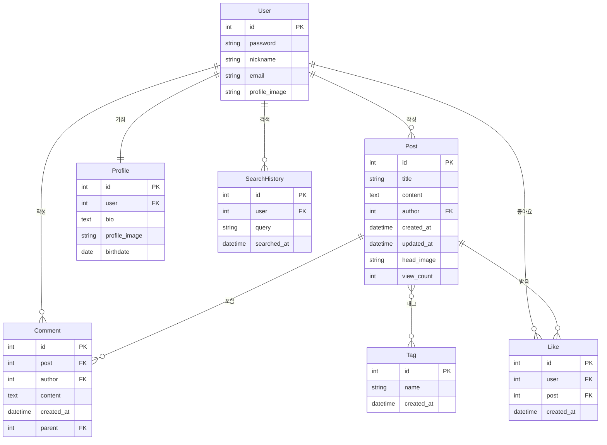

# 여행 블로그
Django를 활용한 여행 블로그 웹 프로젝트입니다.

## 1. 목표와 구현 기능
### 1.1 목표
### 1.2 기능

## 2. 개발 환경 및 배포 URL
### 2.1 개발 환경
### 2.2 URL 구조(모놀리식)
- main
  
| URL 경로 | 설명 | 접근 제한 |
|----------|------|-----------|
| `/` | 메인 페이지 | - |
| `/about` | 소개 페이지 | - |
| `/contact` | 주소 페이지 | - |
| `/test` | 테스트 페이지 | - |
 

- posts
  
| URL 경로 | 설명 | 접근 제한 |
|----------|------|-----------|
| `/posts/write` | 게시글 작성 | 로그인 필요 |
| `/posts` | 게시글 목록 | - |
| `/posts/<int:id>` | 게시글 상세 | - |
| `/posts/edit/<int:id>` | 게시글 수정 | 로그인, 본인 글만 |
| `/posts/delete/<int:id>` | 게시글 삭제 | 로그인, 본인 글만 |
| `/posts/search/<str:tag>` | 게시글 검색 | - |
| `/posts/<int:post_id>/comment/create` | 댓글 작성 | 로그인 필요 |
| `/posts/<int:post_id>/comment/<int:comment_id>/edit` | 댓글 수정 | 로그인, 본인 댓글만 |
| `/posts/<int:post_id>/comment/<int:comment_id>/delete` | 댓글 삭제 | 로그인, 본인 댓글만 |
| `/posts/<int:post_id>/like` | 게시글 좋아요 토글 | 로그인 필요 |
  

- accounts
  
| URL 경로 | 설명 | 접근 제한 |
|----------|------|-----------|
| `/signup` | 회원가입 | - |
| `/login` | 로그인 | - |
| `/logout` | 로그아웃 | 로그인 필요 |
| `/password_change` | 비밀번호 변경 | 로그인 필요 |
| `/profile` | 유저 프로필 | 로그인 필요 |
| `/profile/edit` | 프로필 수정 | 로그인 필요 |
 

- interactions
  
| URL 경로 | 설명 | 접근 제한 |
|----------|------|-----------|
| `/tags` | 태그 목록 | - |
| `/tags/<str:tag_name>` | 특정 태그의 게시글 목록 | - |
| `/search-history` | 사용자의 검색 기록 보기 | 로그인 필요 |
 

## 3. 프로젝트 구조와 개발 일정
### 3.1 프로젝트 구조
### 3.2 개발 일정(WBS)

## 4. 와이어프레임

## 5. 데이터베이스 모델링(ERD)

## 6. 메인 기능
## 7. 에러와 에러 해결
## 8. 회고
