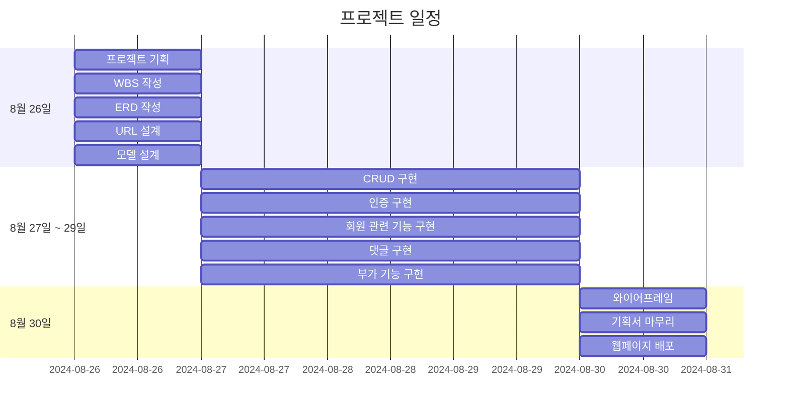
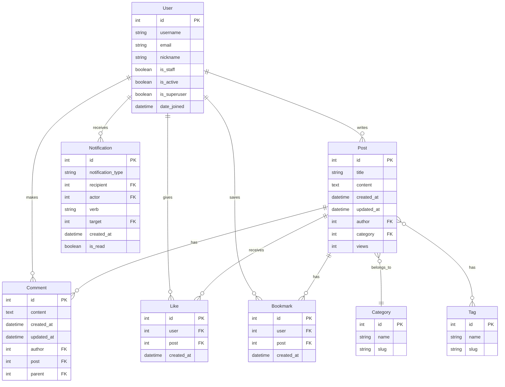

# 여행 블로그
Django를 활용한 여행 블로그 웹 프로젝트입니다.

## 1. 목표와 구현 기능
### 1.1 목표
### 1.2 기능

## 2. 개발 환경 및 배포 URL
### 2.1 개발 환경
### 2.2 URL 구조(모놀리식)
- Main App URLs

| URL Pattern | View Name | Description |
|-------------|-----------|-------------|
| `admin/` | admin.site.urls | Django admin interface |
| `''` | include('posts.urls') | Include all posts URLs |
| `accounts/` | include('accounts.urls') | Include all accounts URLs |
| `interactions/` | include('interactions.urls') | Include all interactions URLs |

- Accounts App URLs

| URL Pattern | View Name | Description |
|-------------|-----------|-------------|
| `signup/` | signup | User registration |
| `login/` | login | User login |
| `logout/` | logout | User logout |
| `profile/` | profile | User profile view |
| `profile/edit/` | edit_profile | Edit user profile |
| `password/change/` | change_password | Change user password |

- Posts App URLs

| URL Pattern | View Name | Description |
|-------------|-----------|-------------|
| `''` | home | Home page |
| `post/new/` | post_new | Create new post |
| `post/<int:pk>/` | post_detail | View post details |
| `post/<int:pk>/edit/` | post_edit | Edit existing post |
| `post/<int:pk>/delete/` | post_delete | Delete post |
| `posts/` | post_list | List all posts |
| `category/<slug:category_slug>/` | category_posts | List posts by category |
| `tag/<slug:tag_slug>/` | tag_posts | List posts by tag |
| `search/` | search_posts | Search posts |

- Interactions App URLs

| URL Pattern | View Name | Description |
|-------------|-----------|-------------|
| `post/<int:pk>/comment/` | add_comment | Add comment to post |
| `comment/<int:pk>/reply/` | add_reply | Reply to comment |
| `comment/<int:pk>/edit/` | edit_comment | Edit comment |
| `comment/<int:pk>/delete/` | delete_comment | Delete comment |
| `post/<int:pk>/like/` | like_post | Like/unlike post |
| `post/<int:pk>/bookmark/` | bookmark_post | Bookmark/unbookmark post |
| `notifications/` | notifications | View user notifications |

## 3. 프로젝트 구조와 개발 일정
### 3.1 프로젝트 구조
### 3.2 개발 일정(WBS)

## 4. 와이어프레임

## 5. 데이터베이스 모델링(ERD)

## 6. 메인 기능
## 7. 에러와 에러 해결
## 8. 회고
