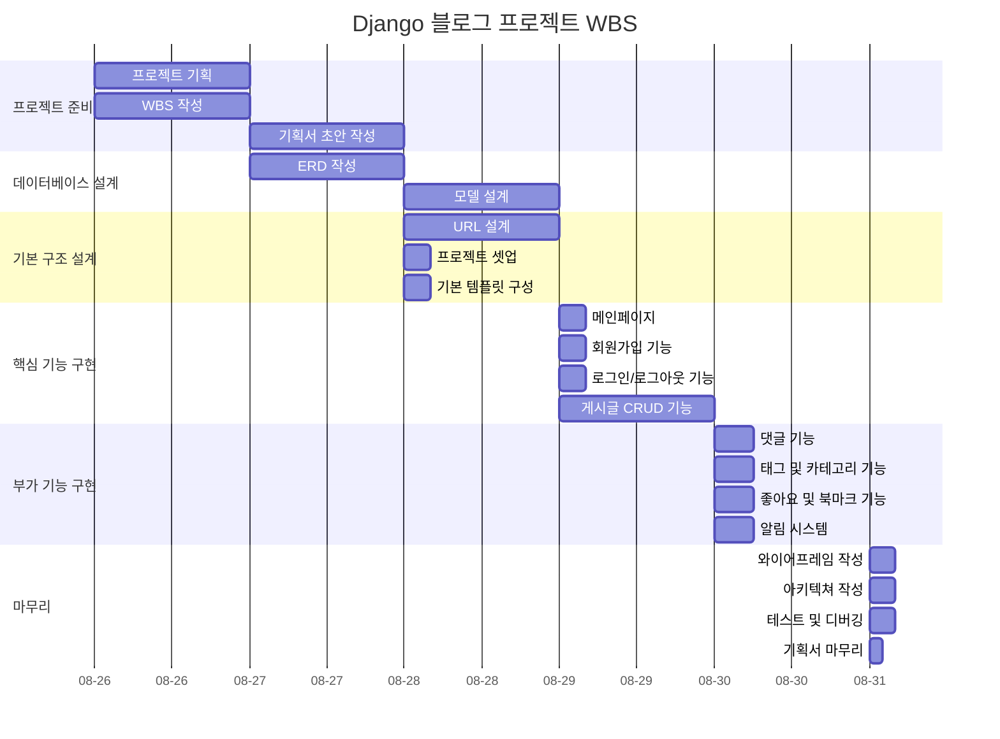
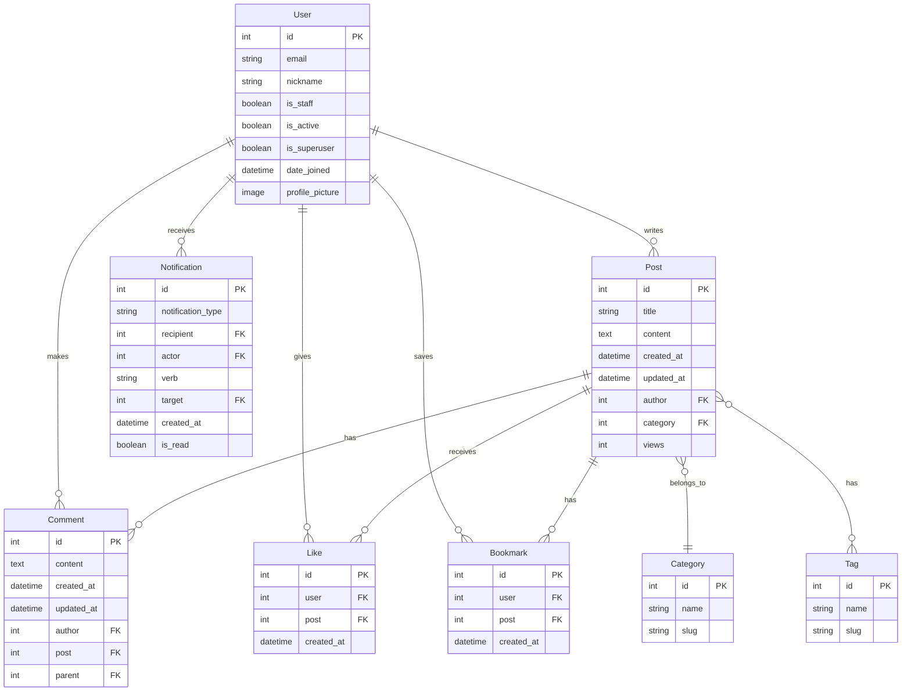

# 반려동물 커뮤니티 블로그

## 1. 목표와 구현 기능

### 1.1 목표

- **1. 커뮤니티 활성화 및 소통**

    - 반려동물 애호가들이 활발하게 소통할 수 있는 온라인 커뮤니티를 구축하여, 사용자들이 자신의 경험을 나누고 서로의 질문에 답하며 유대감을 형성할 수 있도록 지원합니다. 

- **2. 반려동물 관련 정보 교류 및 교육**

    - 반려동물의 건강, 훈련, 영양 등 다양한 주제에 대한 유용하고 신뢰할 수 있는 정보를 제공하여, 사용자가 지식을 쌓고 올바른 돌봄 방법을 배울 수 있도록 합니다. 이를 통해 반려동물의 복지를 향상시키는 데 기여합니다.

- **3. 이벤트 및 활동 지원**

    - 반려동물 관련 다양한 온라인 및 오프라인 이벤트를 기획하고 지원하여, 커뮤니티의 참여를 유도하고, 사용자들이 더욱 활발히 활동할 수 있는 기회를 제공합니다. 이를 통해 커뮤니티의 활성화를 도모합니다.

- **4. 전문가, 기업과의 연계**

    - 수의사, 훈련사, 관련 기업 등과 협력하여 신뢰할 수 있는 전문적인 정보를 제공하고, 사용자들이 전문가와 직접 소통할 수 있는 기회를 마련합니다. 이를 통해 커뮤니티의 신뢰성을 높이고, 사용자들에게 유익한 자원을 제공합니다.

### 1.2 기능

-  **1. 메인페이지** 
    - 페이지 제목과 블로그 입장하기 버튼이 있습니다.
    - 회원가입/로그인 버튼이 있습니다.
    - 회원가입 버튼을 클릭하면 회원가입 페이지로 이동합니다.
    - 로그인 버튼을 클릭하면 로그인 페이지로 이동합니다.

- **2. 회원가입**
    - 회원가입을 할 수 있는 페이지가 있습니다.
    - 입력받는 값은 id(email), password입니다.

- **3. 로그인**
    - 로그인을 할 수 있는 페이지가 있습니다.
    - 입력받는 값은 id(email), password입니다.
    
- **4. 회원 프로필**
    - 프로필 및 프로필 이미지 수정, 비밀번호 변경이 가능합니다.
    - 닉네임이 있으며, 블로그 활동은 닉네임으로 하게 됩니다.

- **5. 게시글 작성**
    - 로그인을 한 유저만 해당 기능을 사용 할 수 있습니다.
    - 게시글 제목과 내용을 작성 할 수 있는 페이지가 있습니다.
    - 작성한 게시글이 저장되어 게시글 목록에 보입니다.
    - 사진 업로드가 가능합니다.
    - 게시글 조회수 기능이 있습니다.

- **6. 게시글 목록**
    - 모든 사용자들이(로그인을 하지 않은 사용자 포함) 게시한 블로그 게시글들의 제목을 확인 할 수 있습니다.
    - 저자, 카테고리, 태그, 조회수를 볼 수 있습니다.
    - 작성 시간에 따라 정렬되며, 최신 글이 가장 먼저 보이게 되어 있습니다.

- **7. 게시글 상세보기**
    - 게시글의 제목/내용을 보는 기능입니다.
    - 게시글의 카테고리, 태그, 조회수, 저자(닉네임)을 볼 수 있습니다.

- **8. 게시글 수정**
    - 로그인을 한 유저만 해당 기능을 사용 할 수 있습니다.
    - 본인의 게시글이 아니라면 수정이 불가능합니다.
    - 게시글의 제목 또는 내용을 수정 하는 기능입니다.
    - 게시글 제목과 내용을 수정 할 수 있는 페이지가 있습니다.
    - 수정된 내용은 게시글 목록보기/상세보기에 반영됩니다.

- **9. 게시글 삭제**
    - 로그인을 한 유저만 해당 기능을 사용 할 수 있습니다.
    - 본인의 게시글이 아니라면 수정이 불가능합니다.
    - 게시글을 삭제하는 기능입니다.
    - 삭제를 완료한 이후에 게시글 목록 화면으로 돌아갑니다.
    - 삭제된 게시글은 게시글 목록보기/상세보기에서 접근이 불가능합니다.

- **10. 게시글 검색**
    - 제목과 내용을 사용자 쿼리로 검색할 수 있습니다.
    - 특정한 카테고리, 태그를 선택하여 게시글을 찾아 볼 수 있습니다.
    - 검색한 게시물은 시간순에 따라 정렬되어 있습니다.

- ~~**11. 댓글 기능**~~
    - 댓글 추가
    - 댓글 삭제
    - 대댓글
    - 댓글 수정

- ~~**12. 좋아요(Like) 기능**~~
    - 사용자가 게시물에 대해 좋아요를 눌러서 반응을 표현할 수 있습니다.

- ~~**13. 북마크(Bookmark) 기능**~~
    - 사용자가 관심 있는 게시물을 나중에 쉽게 찾아볼 수 있도록 북마크 할 수 있습니다.

- ~~**14. 알림 기능**~~
    - 답글 알림댓글에 답글이 달리면 해당 사용자에게 알림을 보냅니다. 
    - 사용자가 작성한 글이나 댓글에 좋아요가 눌리면 알림을 받습니다.

## 2. 개발 환경 및 배포 URL

### 2.1 개발 환경

```
운영 체제: Windows
Python 버전: Python 3.12.5
Django 버전: Django 5.1

IDE/코드 편집기: VS Code
가상 환경: venv (Python의 가상 환경 관리 도구)
버전 관리: GitHub
생성형 AI: ChatGPT, Claude
```

### 2.2 URL 구조(모놀리식)

- Main 앱 URLs

| URL 패턴 | View 이름 | 설명 |
|-------------|-----------|-------------|
| `admin/` | admin.site.urls | 관리자 페이지 |
| `''` | include('posts.urls') | posts URL 포함 |
| `accounts/` | include('accounts.urls') | accounts URL 포함 |

- Accounts 앱 URLs

| URL 패턴 | View 이름 | 설명 |
|-------------|-----------|-------------|
| `signup/` | SignupView | 유저 회원가입 |
| `login/` | CustomLoginView | 유저 로그인 |
| `logout/` | CustomLogoutView | 유저 로그아웃 |
| `profile/` | ProfileView | 유저 프로필 열람 |
| `profile/edit/` | EditProfileView | 유저 프로필 수정 |
| `password/change/` | ChangePasswordView| 유저 비밀번호 수정 |
| ~~`notifications/`~~ | ~~NotificationsView~~ | ~~유저 알림(로그인 필요)~~ |

- Posts App URLs

| URL 패턴 | View 이름 | 설명 |
|-------------|-----------|-------------|
| `''` | home | Home page |
| `post/new/` | PostCreateView | 새 게시글 생성(로그인 필요) |
| `post/<int:pk>/` | PostDetailView | 특정 게시글 열람 |
| `post/<int:pk>/edit/` | PostUpdateView | 게시글 수정(로그인 필요, 본인 글만 가능) |
| `post/<int:pk>/delete/` | PostDeleteView | 게시글 삭제(로그인 필요, 본인 글만 가능) |
| `posts/` | PostListView | 모든 게시글의 리스트 |
| `category/<slug:category_slug>/` | CategoryPostsView | 카테고리별 게시글 리스트 |
| `tag/<slug:tag_slug>/` | TagPostsView | 태그별 게시글 리스트 |
| `search/` | SearchPostsView | 게시글 검색 |
| ~~`post/<int:pk>/comment/`~~ | ~~AddCommentView~~ | ~~게시글 댓글(로그인 필요)~~ |
| ~~`comment/<int:pk>/reply/`~~ | ~~AddReplyView~~ | ~~게시글 댓글의 대댓글(로그인 필요)~~ |
| ~~`comment/<int:pk>/edit/`~~ | ~~EditCommentView~~ | ~~댓글 수정(로그인 필요, 본인 글만 가능)~~ |
| ~~`comment/<int:pk>/delete/`~~ | ~~DeleteCommentView~~ | ~~댓글 삭제(로그인 필요, 본인 글만 가능)~~ |
| ~~`post/<int:pk>/like/`~~ | ~~LikePostView~~ | ~~게시글 좋아요 기능~~ |
| ~~`post/<int:pk>/bookmark/`~~ | ~~BookmarkPostView~~ | ~~북마크 기능(로그인 필요)~~ |

## 3. 프로젝트 구조와 개발 일정

### 3.1 프로젝트 구조

```
📦project_root/
├── 📂accounts/
│   ├── 📜__pycache__/
│   ├── 📜migrations/
│   ├── 📜__init__.py
│   ├── 📜admin.py
│   ├── 📜apps.py
│   ├── 📜forms.py
│   ├── 📜models.py
│   ├── 📜tests.py
│   ├── 📜urls.py
│   └── 📜views.py
├── 📂media/
├── 📂posts/
│   ├── 📜__pycache__/
│   ├── 📜migrations/
│   ├── 📜__init__.py
│   ├── 📜admin.py
│   ├── 📜apps.py
│   ├── 📜forms.py
│   ├── 📜models.py
│   ├── 📜tests.py
│   ├── 📜urls.py
│   └── 📜views.py
├── 📂project/
│   ├── 📜__pycache__/
│   ├── 📜__init__.py
│   ├── 📜asgi.py
│   ├── 📜settings.py
│   ├── 📜urls.py
│   └── 📜wsgi.py
├── 📂static/
│   └── 📂images/
│       └── 📜default_profile_picture.png
├── 📂templates/
│   ├── 📂accounts/
│   │   ├── 📜change_password.html
│   │   ├── 📜edit_profile.html
│   │   ├── 📜logged_out.html
│   │   ├── 📜login.html
│   │   ├── 📜profile.html
│   │   └── 📜signup.html
│   ├── 📂posts/
│   │   ├── 📜post_confirm_delete.html
│   │   ├── 📜post_detail.html
│   │   ├── 📜post_form.html
│   │   └── 📜post_list.html
│   └── 📜base.html
├── 📜venv/
├── 📜.gitignore
├── 📜db.sqlite3
├── 📜manage.py
├── 📜README.md
└── 📜requirements.txt
```

### 3.2 개발 일정(WBS)


## 4. 데이터 테이블

### `User` 테이블

| 컬럼명           | 데이터 타입        | 제약 조건                    | 설명                             |
|------------------|---------------------|------------------------------|----------------------------------|
| id               | INTEGER             | PRIMARY KEY, AUTOINCREMENT   | 사용자 고유 ID (기본 제공 필드)   |
| nickname         | VARCHAR(50)         | UNIQUE, NOT NULL             | 사용자 닉네임                    |
| email            | EMAIL               | UNIQUE, NOT NULL, INDEX      | 사용자 이메일                    |
| profile_picture  | VARCHAR(100)        | NULL                         | 프로필 사진 (파일 경로)          |
| is_staff         | BOOLEAN             | DEFAULT FALSE                | 관리자인지 여부                  |
| is_active        | BOOLEAN             | DEFAULT TRUE                 | 활성화 여부                      |
| is_superuser     | BOOLEAN             | DEFAULT FALSE                | 슈퍼유저 여부                    |
| date_joined      | DATETIME            | DEFAULT CURRENT_TIMESTAMP    | 가입일        

### `Post` 테이블

| 컬럼명       | 데이터 타입      | 제약 조건                     | 설명                       |
|--------------|-------------------|-------------------------------|----------------------------|
| id           | INTEGER           | PRIMARY KEY, AUTOINCREMENT    | 게시물 고유 ID             |
| title        | VARCHAR(200)      | NOT NULL                      | 게시물 제목                |
| content      | TEXT              | NOT NULL                      | 게시물 내용                |
| created_at   | DATETIME          | DEFAULT CURRENT_TIMESTAMP     | 작성일                     |
| updated_at   | DATETIME          | DEFAULT CURRENT_TIMESTAMP ON UPDATE CURRENT_TIMESTAMP | 마지막 수정일          |
| author       | INTEGER           | FOREIGN KEY (AUTH_USER_MODEL) | 작성자 ID                  |
| category     | INTEGER           | FOREIGN KEY (Category), NULL  | 카테고리 ID                |
| tags         | ARRAY/JSON        | NULL                          | 태그 (Django-tagging 사용) |
| image        | VARCHAR(100)      | NULL                          | 이미지 파일 경로           |
| views        | INTEGER           | DEFAULT 0                     | 조회수     


### `Category` 테이블

| 컬럼명 | 데이터 타입   | 제약 조건            | 설명                      |
|--------|----------------|----------------------|---------------------------|
| id     | INTEGER        | PRIMARY KEY, AUTOINCREMENT | 카테고리 고유 ID        |
| name   | VARCHAR(100)   | UNIQUE, NOT NULL     | 카테고리 이름             |
| slug   | VARCHAR(100)   | UNIQUE, NOT NULL     | URL 슬러그                |

## 5. 데이터베이스 모델링(ERD)


## 6. 와이어 프레임

[피그마 와이어프레임](https://www.figma.com/design/rWiRusEVqPzf2xcs10JIpi/%EB%B0%98%EB%A0%A4%EB%8F%99%EB%AC%BC-%EB%B8%94%EB%A1%9C%EA%B7%B8-%EC%BB%A4%EB%AE%A4%EB%8B%88%ED%8B%B0?node-id=0-1&m=dev&t=ZS5rocixoTF8EYGy-1)


## 7. 메인 기능

### 회원가입 및 로그인


### 프로필 수정 및 비밀번호 변경


### 게시글 생성 및 페이지네이션


### 게시글 수정


### 게시글 삭제


### 게시글 검색


## 8. 에러와 에러 해결

1. 로그아웃 페이지 405 에러
    - base.html에서 따로 설정을 하지 않아 GET 방식 -> 에러
    - POST 방식으로 변경

## 9. 회고
아직 Django를 다루는 데에 익숙하지 않고, 모르는 부분이 많아 프로젝트를 완수하지 못했습니다. 프로젝트는 주어진 기간 내에 끝내지 못하고, 기획단계에서 설계한 기능들을 전부 구현하지 못했습니다. 하지만 이번 프로젝트를 통해 Django에서 기능이 구현되는 과정과 원리를 세세하게 이해할 수 있게 되었고, 또 Django가 얼마나 효율적이며 구조가 매력적인 프로그램인지 다시 한번 깨닫게 되는 좋은 기회였습니다. 장고의  '마감기간에 쫓기는 자들을 위한 프레임워크' 문구를 새삼 직접 체험해보는 시간이였습니다.