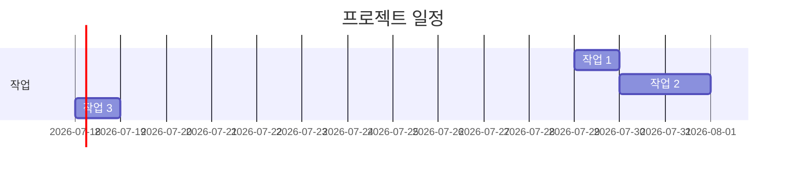

### 목차
- [프로젝트의 개요](#프로젝트의-개요)
- []


## 프로젝트 개요

### 1. 프로젝트의 목적
chat gpt api를 활용한 인공지능 일본어 회화 실습 서비스 프로젝트
### 2. 


```mermaid
graph TD
    A[static] --> B(scripts.js)
    A --> C(styles.css)
    D[templates] --> E(index.html)
    Project Root --> A[static]
    Project Root --> D[templates]
    Project Root --> F(app.py)
```




중간에 에러
(음성 발성을 인식하는 문제) -> 음성 발성하는동안 인식함수를 끔

voice 버튼 문제
(작동 하는지 안하는지 헷갈림) -> 작동할때만 버튼색이 바뀜

프롬프트 끼리 충돌 ( 한국어 피드백 & 문단 길이 제한 -> 피드백 x)
프롬프트를 10개로 제한, 일본어 문법 피드백 확실히 명시. 일본어 문장 갯수 제한

# **Hana**
[웹 URL](https://5247b9f7-a0ab-44f1-b793-06342caa1505-00-22n07igtg5n15.sisko.replit.dev/)
