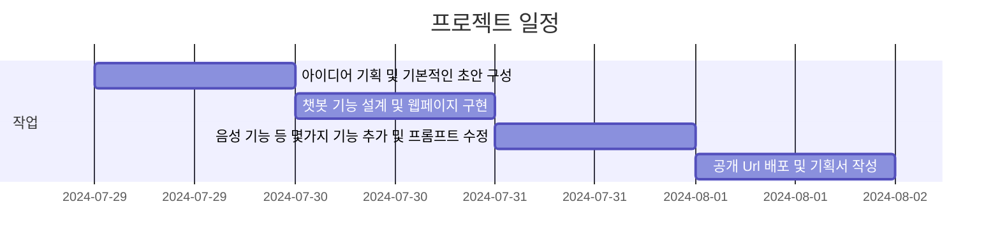
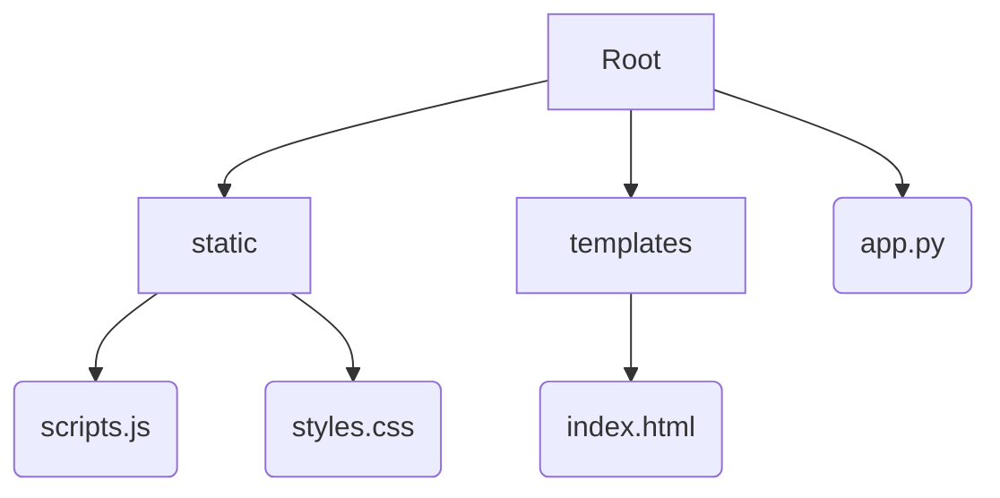

# **Hana** : GPT API를 활용한 일본어 회화 실습 프로젝트

## 1. 프로젝트 기획 및 과정

### 기획 아이디어
  - GPT API를 활용한 챗봇을 활용 할 수 있는 방법 모색
  - 작성자 본인이 j-pop 노래 부르기 취미를 갖고 있지만, 일본어 회화 능력이 부족한 점을 고려
  - 작성자를 포함하여 일본 회화 실습 실력을 키우고 싶어하는 학습자들에게 수요가 있을 것이라 판단함

### 계획 설계 및 개발자 도구 선정
  - 사용자가 진짜 일본어 회화 선생님처럼 느낄 수 있게 자유도를 높힐 것
  - 너무 복잡하고 어려운 말이 아닌, 일상 생활에서 간단하게 사용할 수 있는 단어와 문법을 사용자에게 명시
  - 사용자와의 대화를 이끌어 나가며, 사용자의 답변을 유도할 수 있는 여러 질문들을 던질 것

  **사용한 개발자 도구들 및 구현 기능 :** 
  ```md
  **Python** : GPT API 호출 및 회화 서비스용 프롬프트 설계
  **Html** : 기본적인 Web 구조 구현
  **Css** : Web의 간단한 디자인 구현
  **JavaScript** : 사용자와 API 간의 비동기 통신 구현, Web의 기본적인 기능 설계
  ```

### 개발 일정



## 2. 구조 및 설계

### 디렉토리 구조

### 와이어 프레임


## 시연 및 오류 수정

중간에 에러
(음성 발성을 인식하는 문제) -> 음성 발성하는동안 인식함수를 끔

voice 버튼 문제
(작동 하는지 안하는지 헷갈림) -> 작동할때만 버튼색이 바뀜

프롬프트 끼리 충돌 ( 한국어 피드백 & 문단 길이 제한 -> 피드백 x)
프롬프트를 10개로 제한, 일본어 문법 피드백 확실히 명시. 일본어 문장 갯수 제한


## 배포 및 추가 기능

**Hana**
[웹 URL](https://5247b9f7-a0ab-44f1-b793-06342caa1505-00-22n07igtg5n15.sisko.replit.dev/)