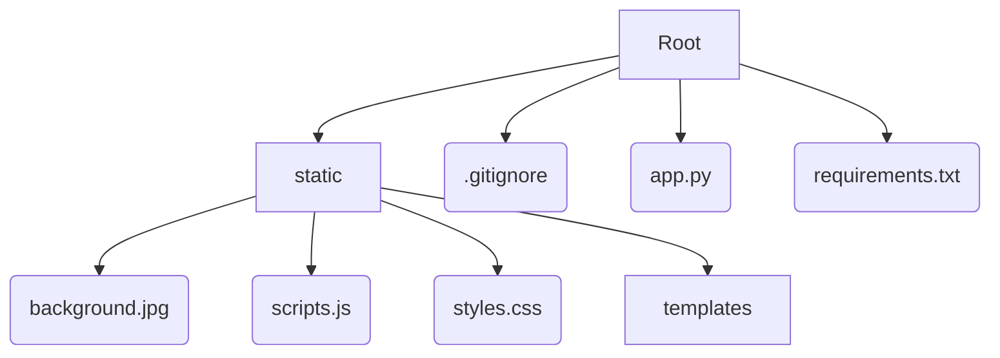
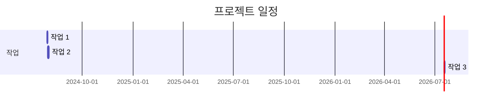
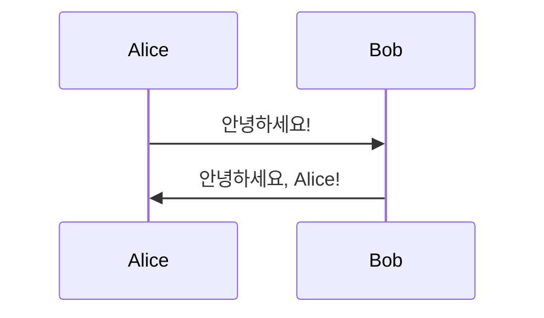

### 목차
- [프로젝트의 개요](#프로젝트의-개요)
- []

## 프로젝트 개요

### 1. 프로젝트의 목적
chat gpt api를 활용한 인공지능 일본어 회화 실습 서비스 프로젝트
### 2. 

```mermaid
graph TD
    A[static] --> B(background.jpg)
    A --> C(scripts.js)
    A --> D(styles.css)
    A --> E[templates]
    Root --> A
    Root --> F(.gitignore)
    Root --> G(app.py)
    Root --> J(requirements.txt)
```

```mermaid
gantt
    title 프로젝트 일정
    dateFormat  YYYY-MM-DD
    section 작업
    작업 1 :a1, 2024-07-29, 1d
    작업 2 :after a1  , 2d
    작업 3 :after a2  , 1d
```

```mermaid
sequenceDiagram
    Alice->>Bob: 안녕하세요!
    Bob->>Alice: 안녕하세요, Alice!
```