# 반려동물 커뮤니티 블로그

## 1. 목표와 구현 기능

### 1.1 목표

### 1.2 기능

## 2. 개발 환경 및 배포 URL

### 2.1 개발 환경

### 2.2 URL 구조(모놀리식)

- Main 앱 URLs

| URL 패턴 | View 이름 | 설명 |
|-------------|-----------|-------------|
| `admin/` | admin.site.urls | 관리자 페이지 |
| `''` | include('posts.urls') | posts URL 포함 |
| `accounts/` | include('accounts.urls') | accounts URL 포함 |

- Accounts 앱 URLs

| URL 패턴 | View 이름 | 설명 |
|-------------|-----------|-------------|
| `signup/` | SignupView | 유저 회원가입 |
| `login/` | CustomLoginView | 유저 로그인 |
| `logout/` | CustomLogoutView | 유저 로그아웃 |
| `profile/` | ProfileView | 유저 프로필 열람 |
| `profile/edit/` | EditProfileView | 유저 프로필 수정 |
| `password/change/` | ChangePasswordView| 유저 비밀번호 수정 |
| ~~`notifications/`~~ | ~~NotificationsView~~ | ~~유저 알림(로그인 필요)~~ |

- Posts App URLs

| URL 패턴 | View 이름 | 설명 |
|-------------|-----------|-------------|
| `''` | home | Home page |
| `post/new/` | PostCreateView | 새 게시글 생성(로그인 필요) |
| `post/<int:pk>/` | PostDetailView | 특정 게시글 열람 |
| `post/<int:pk>/edit/` | PostUpdateView | 게시글 수정(로그인 필요, 본인 글만 가능) |
| `post/<int:pk>/delete/` | PostDeleteView | 게시글 삭제(로그인 필요, 본인 글만 가능) |
| `posts/` | PostListView | 모든 게시글의 리스트 |
| `category/<slug:category_slug>/` | CategoryPostsView | 카테고리별 게시글 리스트 |
| `tag/<slug:tag_slug>/` | TagPostsView | 태그별 게시글 리스트 |
| `search/` | SearchPostsView | 게시글 검색 |
| ~~`post/<int:pk>/comment/`~~ | ~~AddCommentView~~ | ~~게시글 댓글(로그인 필요)~~ |
| ~~`comment/<int:pk>/reply/`~~ | ~~AddReplyView~~ | ~~게시글 댓글의 대댓글(로그인 필요)~~ |
| ~~`comment/<int:pk>/edit/`~~ | ~~EditCommentView~~ | ~~댓글 수정(로그인 필요, 본인 글만 가능)~~ |
| ~~`comment/<int:pk>/delete/`~~ | ~~DeleteCommentView~~ | ~~댓글 삭제(로그인 필요, 본인 글만 가능)~~ |
| ~~`post/<int:pk>/like/`~~ | ~~LikePostView~~ | ~~게시글 좋아요 기능~~ |
| ~~`post/<int:pk>/bookmark/`~~ | ~~BookmarkPostView~~ | ~~북마크 기능(로그인 필요)~~ |

## 3. 프로젝트 구조와 개발 일정

### 3.1 프로젝트 구조

project_root/ ├── accounts/ │ ├── pycache/ │ ├── migrations/ │ ├── init.py │ ├── admin.py │ ├── apps.py │ ├── forms.py │ ├── models.py │ ├── tests.py │ ├── urls.py │ └── views.py ├── media/ ├── posts/ │ ├── pycache/ │ ├── migrations/ │ ├── init.py │ ├── admin.py │ ├── apps.py │ ├── forms.py │ ├── models.py │ ├── tests.py │ ├── urls.py │ └── views.py ├── project/ │ ├── pycache/ │ ├── init.py │ ├── asgi.py │ ├── settings.py │ ├── urls.py │ └── wsgi.py ├── static/ │ └── images/ │ └── default_profile_picture... ├── templates/ │ ├── accounts/ │ │ ├── change_password.html │ │ ├── edit_profile.html │ │ ├── logged_out.html │ │ ├── login.html │ │ ├── profile.html │ │ └── signup.html │ ├── posts/ │ │ ├── post_confirm_delete.html │ │ ├── post_detail.html │ │ ├── post_form.html │ │ └── post_list.html │ └── base.html ├── venv/ ├── .gitignore ├── db.sqlite3 ├── manage.py ├── README.md └── requirements.txt

### 3.2 개발 일정(WBS)

## 4. 데이터 테이블

### `User` 테이블

| 컬럼명           | 데이터 타입        | 제약 조건                    | 설명                             |
|------------------|---------------------|------------------------------|----------------------------------|
| id               | INTEGER             | PRIMARY KEY, AUTOINCREMENT   | 사용자 고유 ID (기본 제공 필드)   |
| nickname         | VARCHAR(50)         | UNIQUE, NOT NULL             | 사용자 닉네임                    |
| email            | EMAIL               | UNIQUE, NOT NULL, INDEX      | 사용자 이메일                    |
| profile_picture  | VARCHAR(100)        | NULL                         | 프로필 사진 (파일 경로)          |
| is_staff         | BOOLEAN             | DEFAULT FALSE                | 관리자인지 여부                  |
| is_active        | BOOLEAN             | DEFAULT TRUE                 | 활성화 여부                      |
| is_superuser     | BOOLEAN             | DEFAULT FALSE                | 슈퍼유저 여부                    |
| date_joined      | DATETIME            | DEFAULT CURRENT_TIMESTAMP    | 가입일        

### `Post` 테이블

| 컬럼명       | 데이터 타입      | 제약 조건                     | 설명                       |
|--------------|-------------------|-------------------------------|----------------------------|
| id           | INTEGER           | PRIMARY KEY, AUTOINCREMENT    | 게시물 고유 ID             |
| title        | VARCHAR(200)      | NOT NULL                      | 게시물 제목                |
| content      | TEXT              | NOT NULL                      | 게시물 내용                |
| created_at   | DATETIME          | DEFAULT CURRENT_TIMESTAMP     | 작성일                     |
| updated_at   | DATETIME          | DEFAULT CURRENT_TIMESTAMP ON UPDATE CURRENT_TIMESTAMP | 마지막 수정일          |
| author       | INTEGER           | FOREIGN KEY (AUTH_USER_MODEL) | 작성자 ID                  |
| category     | INTEGER           | FOREIGN KEY (Category), NULL  | 카테고리 ID                |
| tags         | ARRAY/JSON        | NULL                          | 태그 (Django-tagging 사용) |
| image        | VARCHAR(100)      | NULL                          | 이미지 파일 경로           |
| views        | INTEGER           | DEFAULT 0                     | 조회수     

### `Category` 테이블

| 컬럼명 | 데이터 타입   | 제약 조건            | 설명                      |
|--------|----------------|----------------------|---------------------------|
| id     | INTEGER        | PRIMARY KEY, AUTOINCREMENT | 카테고리 고유 ID        |
| name   | VARCHAR(100)   | UNIQUE, NOT NULL     | 카테고리 이름             |
| slug   | VARCHAR(100)   | UNIQUE, NOT NULL     | URL 슬러그                |

## 5. 데이터베이스 모델링(ERD)

```mermaid
erDiagram
    User ||--o{ Post : writes
    User ||--o{ Comment : makes
    User ||--o{ Like : gives
    User ||--o{ Bookmark : saves
    User ||--o{ Notification : receives
    Post ||--o{ Comment : has
    Post ||--o{ Like : receives
    Post ||--o{ Bookmark : has
    Post }o--|| Category : belongs_to
    Post }o--o{ Tag : has

    User {
        int id PK
        string email
        string nickname
        boolean is_staff
        boolean is_active
        boolean is_superuser
        datetime date_joined
        image profile_picture
    }

    Post {
        int id PK
        string title
        text content
        datetime created_at
        datetime updated_at
        int author FK
        int category FK
        int views
    }

    Category {
        int id PK
        string name
        string slug
    }

    Comment {
        int id PK
        text content
        datetime created_at
        datetime updated_at
        int author FK
        int post FK
        int parent FK
    }

    Like {
        int id PK
        int user FK
        int post FK
        datetime created_at
    }

    Bookmark {
        int id PK
        int user FK
        int post FK
        datetime created_at
    }

    Notification {
        int id PK
        string notification_type
        int recipient FK
        int actor FK
        string verb
        int target FK
        datetime created_at
        boolean is_read
    }

    Tag {
        int id PK
        string name
        string slug
    }

```

## 6. 와이어 프레임

## 7. 메인 기능
## 8. 에러와 에러 해결
## 9. 회고
